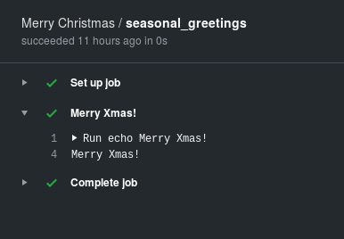

# Put some (GitHub) action(s) in your Raku (repositories)

After being in beta for quite a long time, GitHub actions were finally
introduced to the general public in November 2019. They have very soon
become ubiquituous, over all combined with the other release that
were recently made by GitHub, the package (and container) registry.

We can put them to good use with our Raku modules. Well see how.

## We could use some action

An action is a script that is triggered by an event in your
repository. In principle, anything you or a program does when
interacting with a repository could trigger an action. Of course, this
includes git actions, which include basically pushing to the
repository, but also all kinds of things happening in the repository,
from changes in the wiki to adding a review to a pull request.

And what kind of things can you do? GitHub creates a container with
some basic toolchains, as well as language intepreters and compilers of your
choice. At the very basic level, what you have is a container where
you can run a script triggered by an event.

GitHub actions reside in a YAML file places within a
`.github/workflows` directory in your repository. Let's go for our
first one:

<script src="https://gist.github.com/JJ/39fa1e49b28e962ae1914514feada12a.js"></script>

This script is as simple as it gets. It contains a single job, with a
single step. Let's go little by little:

* We give it a name, "Merry Christmas". That name will show up in your
  list of actions
* `on` is the list of events that will trigger this action. We will
  just list a single event.
* `jobs` is an array that will include the list of jobs that will be
  run sequentially.
* Every job will have its own key in the, which will be used to refer
  to it (and also to store variables, more on this later), and can run
  in its own environment, which you have to select. We'll take
  [`ubuntu-latest`](https://help.github.com/es/actions/automating-your-workflow-with-github-actions/virtual-environments-for-github-hosted-runners#supported-runners-and-hardware-resources),
  which is a Bionic box, but there are other to choose from (more on
  this later). 
* A job has a series of *steps*, every one with a `name` and then a
  sequence of commands. `run` will run on whatever environment is
  defined in that specific step; in this case, a simple shell script
  that prints `Merry Xmas!`
  
Since we've instructed via the `on` command to run every time there's
a `push` to the repository, the tab Actions will show [the result of
running it, just like this](https://github.com/JJ/raku-advent-calendar-article-2019/commit/1cbe9578458dcd7b425e94a58998c53a1af49fe9/checks?check_suite_id=340377462). If
nothing goes wrong, and how could it, since it's simply a script, it
will show green check marks and produce the result:



These steps form a kind of pipeline, and every step can produce an output or change the environment that is going to be used in the next step; that means that you can create *pipe* actions that just process input and produce something for an output, like this one

```
name: "One step up"
on: [push]

jobs:
  seasonal_greetings:
    runs-on: ubuntu-latest
    steps:
      - name: Pre-Merry Xmas!
        env:
          greeting: "Merry"
          season: "Xmas"
        run: |
          sentence="$greeting $season!"
          echo ::set-env name=SENTENCE::$sentence
      - name: Greet
        id: greet
        run: |
          output=$(python -c "import os; print(os.environ['SENTENCE'])")
          echo ::set-output name=printd::$output
      - name: Run Ruby
        env:
          OUTPUT: ${{ steps.greet.outputs.printd }}
        run: /opt/hostedtoolcache/Ruby/2.6.3/x64/bin/ruby -e "puts ENV['OUTPUT']"
```

The first step in this action, code-named "Pre-Merry Xmas!", declares
a couple off environment variables via `env`. We will collate them in
a single `sentence`. But here comes the gist of it: GitHub Actions use
meta-sentences, preceded with `::`, that are printed to output and
interpreted as commands for the next step. In this case, `::set-env`
sets an environment variable.

The next step showcases the use of Python, which is another default
tool in this environment; as a matter of fact, it's included in every
environment out there, together with Node; you can use it in its
default version or set the version as an action variable. This step
also uses a similar mechanism to set, instead of an environment
variable, an *output* that can be used by the next step.

Unlike Python, Ruby does not have a default version available in the
path; however, it's only a matter of finding the path to it and you
can use it, like here. This step also uses the output of the previous
step; GHAs have contexts, in this case a step context, which can be
used to access the output of previous
steps. `steps.greet.outputs.printd` access the context of the step
whose id is `greet` (which we declared via the `id` key there), and
since we declared the output to be called `printd`, `outputs.printd`
will retrieve the output by that name. Contexts are not available from
within the action environment, which is why we need to assign it first
to an environmen variable. Output will [look like
this](https://github.com/JJ/raku-advent-calendar-article-2019/commit/01da3afeb1a5258293e328a9985a088bc7aa60d0/checks?check_suite_id=341279210),
and it will use green check marks, as well as reveal the output in the
raw log and if you click on the step name.

If you are a longterm Perl use like I am, you will miss that. Ruby,
Python, Node, popular languages, fair enough. But Perl is in the base
Ubuntu 16.04 install. Even if we can use that environment, it seems to
have been eliminated from there. Where do we have to go to use Perl?
To the Windows environments. Let's use it to create a polite bot that
greets you when you create or edit an issue:

```yaml
name: "We 🎔 Perl"
on:
  issues:
    types: [opened, edited, milestoned]

jobs:
  seasonal_greetings:
    runs-on: windows-latest
    steps:
      - name: Checkout
        uses: actions/checkout@v2-beta
      - name: Maybe greet
        id: maybe-greet
        env:
          HEY: "Hey you!"
          GREETING: "Merry Xmas to you too!"
          BODY: ${{ github.event.issue.body }}
          TOKEN: ${{ secrets.GITHUB_TOKEN}}
          ISSUE: ${{ github.event.issue.number }}
        run: |
          $output=(perl utils/printenv.pl)
          $body= @{ 'body'= $output } | ConvertTo-Json
          $header= @{
              'Authorization'="token $ENV:TOKEN"
          }
          Invoke-RestMethod -Uri "https://api.github.com/repos/JJ/raku-advent-calendar-article-2019/issues/$ENV:ISSUE/comments" -Method 'Post' -Body $body -Headers $header
```

Check out first the `on` command, that is set to be fired every time
an issue is created, edited or assigned a milestone, an action that,
for some reason, is called being *milestoned*.


The main difference you see above is the presence of the
`windows-latest` as the environment this action will be run on. But
next we see another nice things of actions: they can be simply
published in GitHub, and can be reused. This `checkout` action does
what it says: checks out the repo code, which is not available by
default. We are not really going to run any check on the code, but we
need the little Perl script we've created. More on this later.

The next step is the one that actually will operate when an issue is
created, changed or, wait for it, milestoned. We declare two different
environment variables: one will be used to comment on issues that
don't mention "Merry", the other if they do. But the nice thing comes
next: we can work with the issue body, which is available as a
*context* variable: `github.event.issue.body`. The next variable is
the magic key that opens the door to the GitHub API. No need to upload
it or anything, it will be there ready for you, and GitHub will keep
track of it and hide it wherever it appears. We will also need the
issue number to comment on it, and we store it in the `$ISSUE`
variable. 

Let's next run the action. We will use the fantastic Perl regexes to
check for the presence of the word Merry in the body, using this
mini-script:

```perl
print( ( ($ENV{BODY} =~ /Merry/) == 1)? $ENV{GREETING} : $ENV{HEY});
```

> The next few PowerShell commands are, by far, the most difficult part
of this article.

We run the script so that we capture, and store, the result in a
variable. And the next commands create PowerShell hashes, and `$body`
is converted to JSON. By using `Invoke-RestMethod` we use GitHub API
to create a comment with the greetings in the issue that was
milestoned or any or the other stuff.
